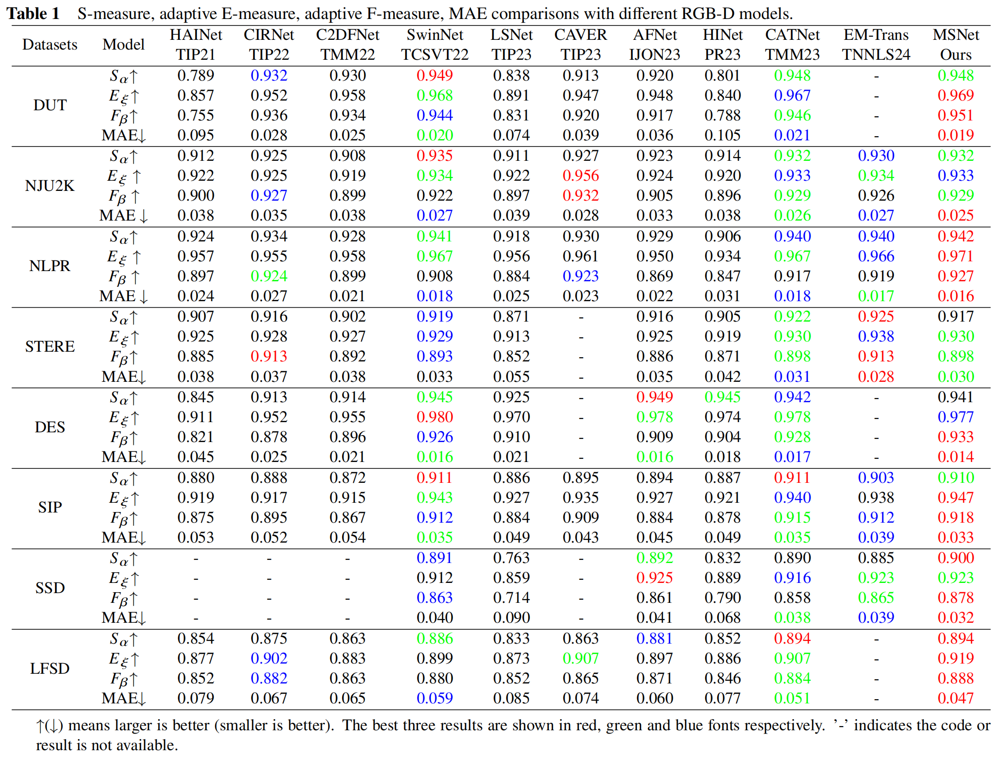
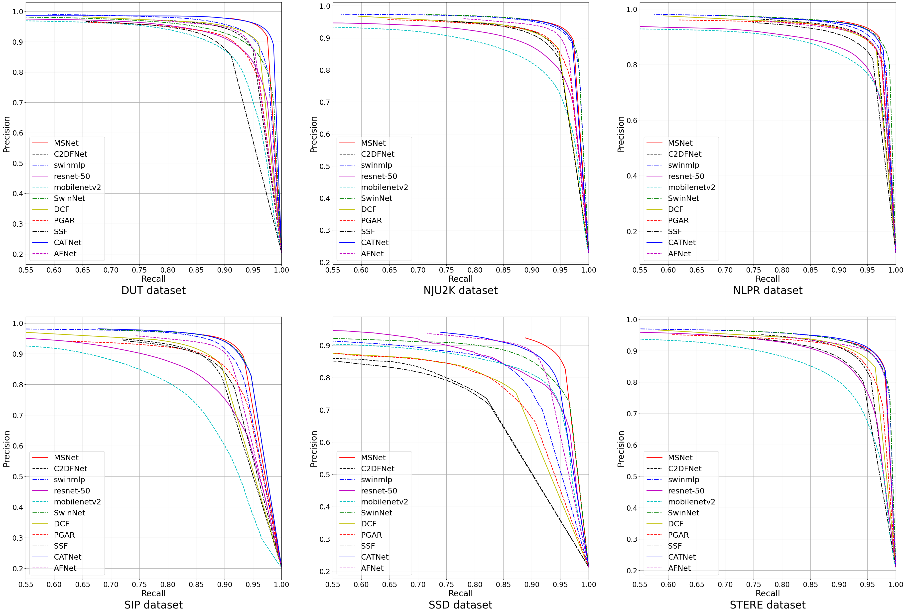
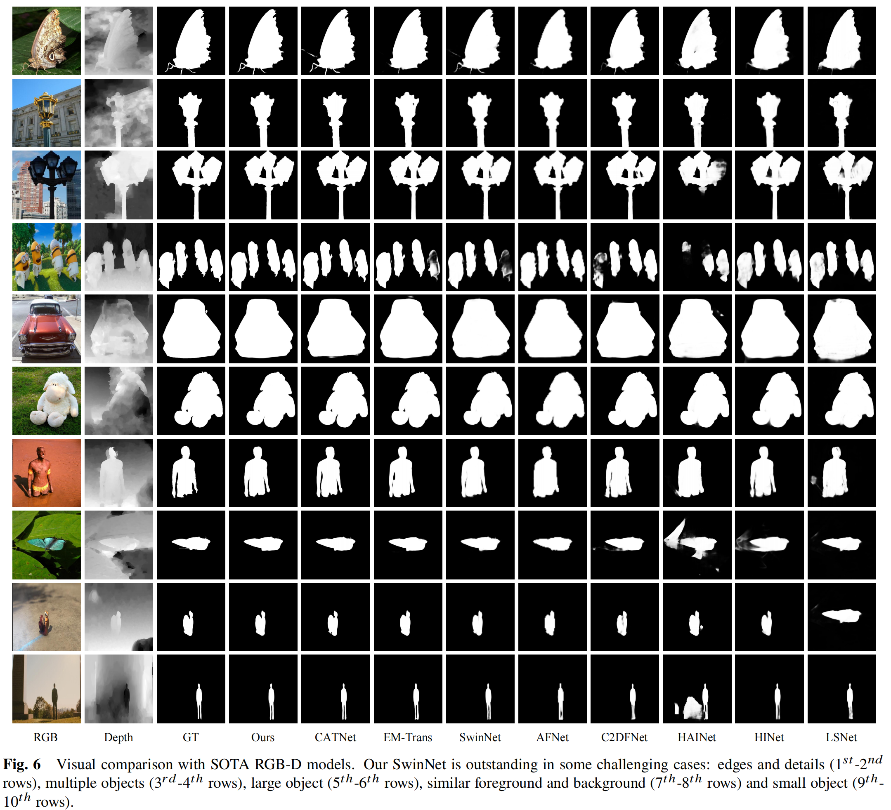

# MSNet: An RGB-D Salient Object Detection Method Based on Feature Enhancement and Feature Fusion


## Requirements
python 3.10.14  
torch 1.11.0+cu113
```
conda create -n msnet python=3.10 -y
conda activate msnet
pip install torch==1.11.0+cu113 torchvision==0.12.0+cu113 torchaudio==0.11.0 --extra-index-url https://download.pytorch.org/whl/cu113
pip install -r requirements.txt
```
## Download Training and Testing Set
You can download the training and testing set from [CATNet](https://github.com/ROC-Star/CATNet)

## Pretraining Parameter
* Swin Transformer Parameter ([Swin Transformer](https://github.com/SwinTransformer/storage/releases/download/v1.0.0/swin_base_patch4_window12_384_22k.pth))
* Our MSNet Parameter:  
  Google: <https://drive.google.com/file/d/1j0KZXCvjCJYJrLrxDiHsBpD_RBlF-Qxm/view?usp=drive_link>

## Training
Please run  
```
python MSNet_train.py
```

## Testing
* Download the pre-trained models above and put them in ./pre.
* Modify paths of pre-trained models and datasets.
* Run  
```
python MSNet_test.py
```

## RGB-D Saliency Maps
Google: <https://drive.google.com/file/d/13EHOrvpB_qGWqePpJySEpngOtLhyb3lX/view?usp=drive_link>

## Evaluation Code
Download the evaluation code from [Evaluation-SOD](https://github.com/Hanqer/Evaluate-SOD)

## Results
* Quantitative Evaluation


* Qualitative Evaluation


## Citation
If you find the information useful, please consider citing:
```

```
