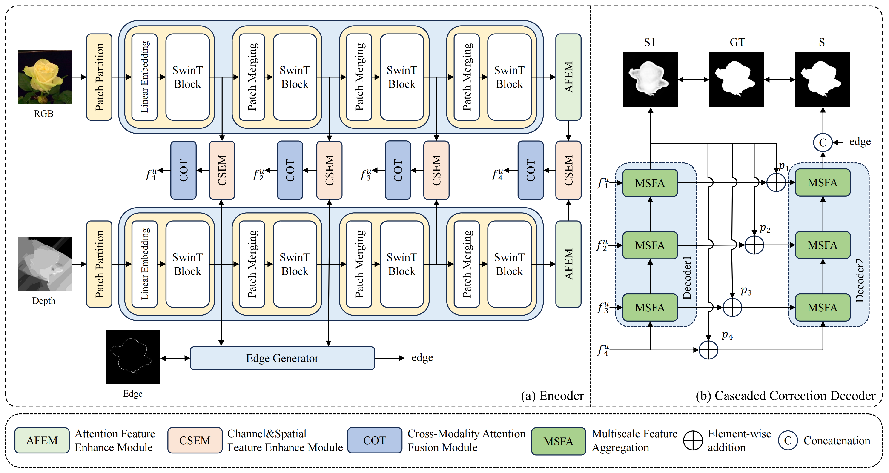

# MSNet: An RGB-D Salient Object Detection Method Based on Feature Enhancement and Feature Fusion


## Requirements
python 3.10.14  
torch 1.11.0+cu111

## Training Set

## Testing Set

## Pretraining Parameter
* Swin Transformer Parameter ([Swin Transformer](https://github.com/SwinTransformer/storage/releases/download/v1.0.0/swin_base_patch4_window12_384_22k.pth))
* Our RGB-D SOD Parameter:  
  Google: <>

## Training
Please run  
```python MSNet_train.py```

## Testing
* Download the pre-trained models above and put them in ./pre.
* Modify pathes of pre-trained models and datasets.
* Run  
```python MSNet_test.py```

## RGB-D Saliency Maps
Google: <>

## Evaluation Code
Download the evaluation code from [Evaluation-SOD](https://github.com/Hanqer/Evaluate-SOD)

## Citation
If you find the information useful, please consider citing:
```

```
